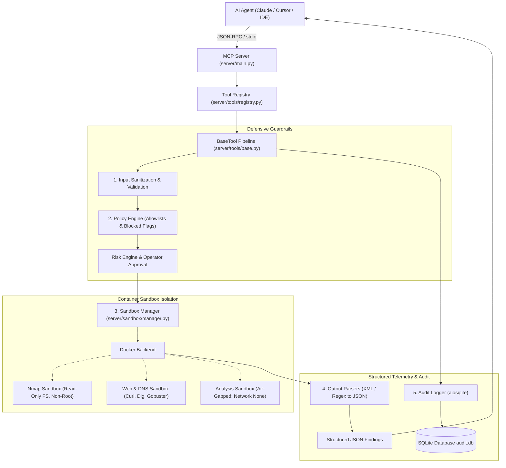

# CyberSec MCP 🛡️

[](https://www.python.org/downloads/)
[](https://modelcontextprotocol.io/)
[]()
[](LICENSE)

An enterprise-grade **Model Context Protocol (MCP)** server that enables AI agents to execute cybersecurity tools through strictly controlled, containerized sandboxes with target allowlisting, argument sanitization, hard timeouts, and immutable audit logs.

---

## 🔒 Core Security Philosophy

> **The LLM never gets arbitrary shell access.**  
> It only interacts through strictly typed, registered MCP tools. Every single tool execution request passes through the **Validation → Policy Gate → Disposable Sandbox Container → Structured JSON Parser → Immutable Audit Logger** pipeline before any response reaches the AI.

---

## 📐 Architecture



---

## 🛠️ Registered Tools

| Tool | Risk Level | Sandbox Image | Network Isolation | Description |
|------|------------|---------------|-------------------|-------------|
| `nmap_scan` | MEDIUM | `cybersec-mcp/nmap:latest` | `bridge` | Port scanning, service fingerprinting, and version detection. |
| `dns_lookup` | LOW | `cybersec-mcp/web-tools:latest` | `bridge` | Queries DNS records (`A`, `AAAA`, `MX`, `NS`, `TXT`, `CNAME`) via `dig`. |
| `whois_lookup` | LOW | `cybersec-mcp/web-tools:latest` | `bridge` | WHOIS domain registration and registrar discovery. |
| `http_probe` | LOW | `cybersec-mcp/web-tools:latest` | `bridge` | HTTP header inspection, security header audit, and server profiling. |
| `directory_scan` | MEDIUM | `cybersec-mcp/web-tools:latest` | `bridge` | Path and endpoint discovery using wordlists via `gobuster`. |
| `hash_file` | LOW | `cybersec-mcp/analysis:latest` | `none` (Air-Gapped) | MD5, SHA1, and SHA256 file hashing inside an unnetworked sandbox. |

---

## 📚 MCP Resources & Prompts

### Resources
- `audit://recent`: Inspect the latest cybersecurity tool executions.
- `audit://session/{session_id}`: Review the complete forensic audit trail for an investigation.
- `policy://rules`: Read current security policies and target allowlists.

### Prompts
- `investigate_target`: Guided multi-phase reconnaissance workflow (DNS → Nmap → HTTP → Directory Scan → Summary).
- `quick_recon`: Fast passive/semi-passive discovery prompt.
- `web_assessment`: Web application security posture & header audit prompt.

---

## 🚀 Getting Started

### 1. Prerequisites
- Python 3.11+
- Docker Engine installed and running

### 2. Installation

Clone and install dependencies:

```bash
git clone https://github.com/allalg/CyberSec-MCP.git
cd CyberSec-MCP
pip install -e ".[dev]"
```

### 3. Build Sandbox Images

```bash
make build-sandboxes
```

Or manually:
```bash
docker build -t cybersec-mcp/nmap:latest sandboxes/nmap
docker build -t cybersec-mcp/web-tools:latest sandboxes/web
docker build -t cybersec-mcp/analysis:latest sandboxes/analysis
```

### 4. Running the Isolated Test Lab (Optional)

Start a local, deliberately vulnerable environment for safe testing:

```bash
make lab-up
```

Targets `172.28.0.10` (Web) and `172.28.0.20` (SSH) will become accessible for testing.

---

## 🔌 Connecting to AI Agents

Add to your Claude Desktop or Cursor MCP configuration (`mcp.json`):

```json
{
  "mcpServers": {
    "cybersec": {
      "command": "python",
      "args": ["-m", "server.main"],
      "cwd": "/path/to/CyberSec-MCP",
      "env": {
        "LOG_LEVEL": "INFO",
        "AUDIT_DB_PATH": "audit.db",
        "MAX_CONCURRENT_SANDBOXES": "3"
      }
    }
  }
}
```

---

## 🧪 Testing

Run the full pytest suite:

```bash
pytest -v
```

All 35 unit and integration tests validate:
- Pydantic models and data validation
- Input sanitization & shell injection rejection
- Policy engine allowlist and blocked flag enforcement
- Output parsers (Nmap XML, dig, whois, curl, gobuster)
- Sandbox manager concurrency and profile isolation
- Asynchronous SQLite audit logging

---

## ⚖️ License

Released under the [MIT License](LICENSE).
