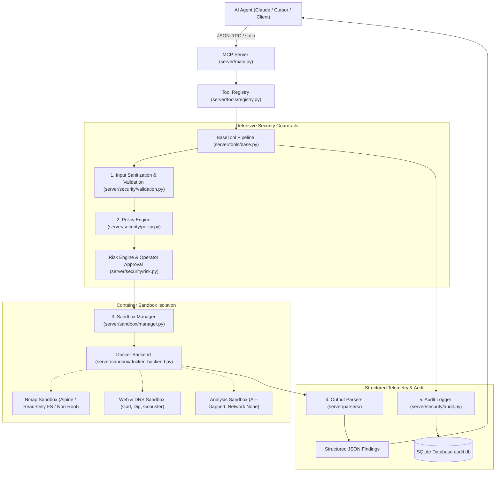

# CyberSec MCP Architecture & Design Guide

## Overview

CyberSec MCP is an enterprise-grade Model Context Protocol (MCP) server that empowers AI agents to execute cybersecurity assessment tools safely. It guarantees strict boundaries by isolating tools inside disposable Docker containers, enforcing target allowlists, verifying syntax and shell injection barriers, and recording every single action to an immutable SQLite audit log.

---

## The 5-Step Execution Pipeline

Every tool execution in CyberSec MCP strictly adheres to the 5-step pipeline implemented in [`server/tools/base.py`](file:///c:/Users/nikhi/OneDrive/Documents/project/CyberSec%20MCP/server/tools/base.py):

1. **Input Validation (`server/security/validation.py`)**:
   - Rejects shell metacharacters (`;|&`$(){}[]!><\n\r\`).
   - Normalizes IP addresses (validates IPv4/IPv6, rejects multicast/broadcast).
   - Enforces port bounds (1-65535, start <= end).
   - Enforces path boundary restrictions and checks for traversal (`../`).
2. **Policy Evaluation (`server/security/policy.py`)**:
   - Confirms the tool is permitted in the active policy rule set (`config/policies.yaml`).
   - Ensures target belongs to the allowed networks (RFC 1918 private subnets: 10.0.0.0/8, 172.16.0.0/12, 192.168.0.0/16, 127.0.0.0/8) or allowed domains (`*.lab.local`, `*.test`, `localhost`).
   - Rejects blocked tool arguments or exploit flags (e.g., `-sE`, `--script=exploit*`).
   - Checks if the tool or cumulative session risk requires operator approval.
3. **Sandboxed Container Execution (`server/sandbox/manager.py`)**:
   - Spawns an isolated Docker container with strict memory caps (64MB - 256MB), CPU quotas (0.25 - 1.0 CPU), and read-only filesystem mounts.
   - Analysis tools run with `network_mode="none"` for true air-gapped isolation.
   - Concurrency is throttled via an `asyncio.Semaphore`.
   - Hard execution timeouts are enforced.
4. **Structured Output Parsing (`server/parsers/`)**:
   - Raw terminal stdout is parsed into structured JSON findings and summary metrics.
   - AI models receive typed, structured data instead of unstructured terminal noise.
5. **Immutable Audit Logging (`server/security/audit.py`)**:
   - Every execution attempt (approved, denied, timed out, or completed) is written to an indexed SQLite database with duration, parameters, findings count, and error state.

---

## Registered Tools & Capabilities

| Tool Name | Risk Level | Sandbox Image | Network Mode | Default Timeout | Description |
|-----------|------------|---------------|--------------|-----------------|-------------|
| `nmap_scan` | MEDIUM | `cybersec-mcp/nmap:latest` | `bridge` | 120s | Port and service scanning with version detection (`-oX -`) |
| `dns_lookup` | LOW | `cybersec-mcp/web-tools:latest` | `bridge` | 30s | DNS record queries (A, AAAA, MX, NS, TXT, CNAME) via `dig` |
| `whois_lookup` | LOW | `cybersec-mcp/web-tools:latest` | `bridge` | 30s | WHOIS registrar, nameserver, and contact lookup |
| `http_probe` | LOW | `cybersec-mcp/web-tools:latest` | `bridge` | 60s | HTTP status codes, security header inspection, server headers |
| `directory_scan` | MEDIUM | `cybersec-mcp/web-tools:latest` | `bridge` | 180s | Web endpoint discovery with wordlists and status code tracking |
| `hash_file` | LOW | `cybersec-mcp/analysis:latest` | `none` (air-gapped) | 30s | MD5, SHA1, SHA256 file hashing inside unnetworked container |

---

## MCP Resources & Prompts

### Resources
- `audit://recent`: Retrieve the most recent execution logs across all tools.
- `audit://session/{session_id}`: Retrieve full forensic audit history for a specific investigation.
- `policy://rules`: Retrieve the active policy configuration and target allowlists.

### Prompts
- `investigate_target(target)`: Automated structured multi-phase reconnaissance workflow.
- `quick_recon(target)`: Rapid low-impact assessment prompt.
- `web_assessment(target)`: Web application security posture & header audit prompt.
